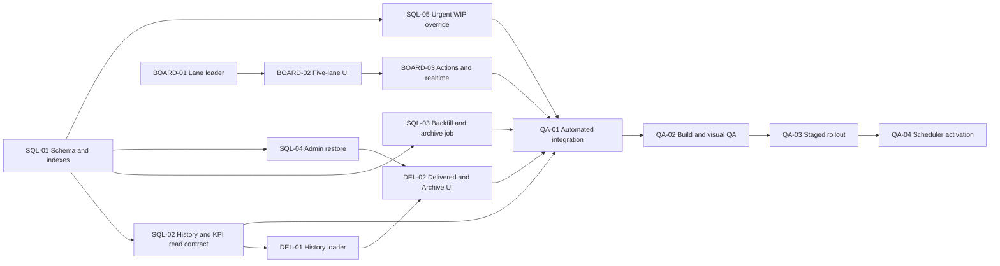

# FlowMate Board: Active Board, Delivered History และ Archive — Implementation Plan

Date: 2026-08-04  
Status: Planned — awaiting implementation approval  
Mode: Multi-agent Project Lead / Plan  
Source design: `docs/superpowers/specs/2026-08-04-flowmate-board-active-delivered-design.md`

## 1. Outcome

ส่งมอบ FlowMate Board ที่รองรับ Task จำนวนมากขึ้น โดยแบ่งงานเป็น 4 Workstream:

1. SQL และ Data lifecycle
2. Active Board
3. Delivered History
4. Integration QA และ Rollout

Implementation ต้องรักษา Workflow, Team Workspace, RLS, Marketing Plan sync และ Historical KPI เดิม พร้อมเพิ่ม Auto archive แบบไม่ลบข้อมูล

## 2. MVP Boundary

### Included

- Active Board 5 คอลัมน์: Unassigned, Assigned, In Progress, Review, Blocked
- Delivered เป็นแท็บ List/Table แยกจาก Active Board
- Server-side query, exact count และ incremental loading แยกตาม Active lane
- Delivered search/filter/pagination แบบ Server-side
- Auto archive งาน Delivered เมื่อครบ 60 วันจาก `delivered_at`
- Admin restore พร้อมเหตุผล, Audit event และ Grace period 7 วัน
- KPI อ่าน Delivered history ได้แม้รายการถูก Archive
- Keyboard, Mobile และ Card/Detail action ที่ไม่ต้องพึ่ง Drag-and-drop
- Urgent Task สามารถข้าม WIP gate ตอน Start/Resume ได้โดยใช้ Urgent reason เดิมเป็น Audit context; งานปกติยังใช้ WIP enforcement เดิม
- Automated tests, GitHub build, visual QA, Supabase dry run, rollout และ rollback

### Deferred

- CSV Export จาก Delivered tab
- Virtualization เต็มรูปแบบ; MVP ใช้ incremental loading 50 รายการต่อ lane/page
- เปลี่ยน Review queue warning ให้เป็น Backend hard limit
- เปลี่ยนสูตร Capacity/KPI
- Global Search ที่ค้น Archive อัตโนมัติ; MVP ใช้ Delivered > Archived scope ที่ชัดเจน

### Non-goals

- ไม่เพิ่ม Status ที่ 7
- ไม่ลบ `Need Brief`, `Queued`, `Cancelled` หรือสถานะส่วนกลางอื่น
- ไม่ Hard delete Task, Comment, Link, Checklist, Event หรือ Notification
- ไม่ขยายสิทธิ์ Team Workspace หรือ Direct table write
- ไม่เปลี่ยน Marketing Plan workflow นอกผล Sync เดิมเมื่อ Delivered

## 3. Locked Contracts

### 3.1 Data truth

- Active query: `archived_at IS NULL` และ Status อยู่ใน 5 Active Board statuses
- Delivered current query: `status = 'delivered'`, `archived_at IS NULL` และ (`delivered_at > now() - interval '60 days'`, `archive_exempt_until > now()` สำหรับรายการที่เพิ่ง Restore หรือ `delivered_at IS NULL` พร้อมป้าย Legacy exception)
- Archived query: `archived_at IS NOT NULL` และคง Team Workspace/RLS scope
- Archive eligibility: `delivered_at <= now() - interval '60 days'`
- เวลาแสดงผลใช้ Asia/Bangkok; Database comparison ใช้ `timestamptz`
- Archived data ยังรวมใน Historical KPI แต่ไม่รวม Active workload/count
- หาก Task ถูกส่งกลับไปแก้แล้ว Delivered ใหม่ ให้ใช้ `delivered_at` จาก Delivered transition ล่าสุดเป็น Retention clock

### 3.2 Frontend query response

Active lane loader:

```js
loadFlowMateBoardLane({ status, cursor = null, limit = 50 })
// => { rows, total, nextCursor, hasMore, asOf }
```

Delivered loader:

```js
loadFlowMateDeliveredHistory({
  scope: "recent" | "archived",
  search,
  deliveredMonth,
  campaign,
  ownerId,
  cursor = null,
  limit = 50,
})
// => { rows, total, nextCursor, hasMore, filterOptions, asOf }
```

Board summary:

```js
loadFlowMateBoardSummary()
// => {
//   counts: { unassigned, assigned, in_progress, review, blocked },
//   wip: { inProgressByOwner, reviewTeamCount, reviewTeamLimit },
//   asOf
// }
```

กติกา:

- `total` มาจาก Server และไม่เปลี่ยนตามจำนวนหน้าที่โหลดแล้ว
- `rows` ใช้ Shape เดียวกับ Card/List เท่าที่จำเป็น
- Loader ทั้งสองใช้ Active Team จาก `getFlowMateActiveTeam()` และให้ RLS เป็น Authority
- ห้ามแก้ Default behavior ของ `loadFlowMateListRows()` เพราะ My Work, List, Attention, Calendar และ Workload ใช้อยู่
- ใช้ Keyset cursor จาก Sort key แทน Deep `OFFSET`; Delivered UI เก็บ Cursor stack สำหรับ Previous/Next

### 3.3 RPC contract

Delivered history read:

```sql
public.flowmate_list_delivered_history(
  p_scope text default 'recent',
  p_search text default null,
  p_delivered_month date default null,
  p_campaign text default null,
  p_owner_member_id uuid default null,
  p_page_size integer default 50,
  p_cursor_delivered_at timestamptz default null,
  p_cursor_id uuid default null
) returns jsonb
```

Archived global search:

```sql
public.flowmate_search_archived_work_items(
  p_search text,
  p_page_size integer default 50,
  p_cursor_archived_at timestamptz default null,
  p_cursor_id uuid default null
) returns jsonb
```

ทั้งสองเป็น Invoker-scoped read contract, Clamp page size 1–100 และไม่รับ User/Team identity จาก Client

Admin restore:

```sql
public.flowmate_admin_restore_work_item(
  p_display_id text,
  p_restore_reason text
) returns jsonb
```

Archive job:

```sql
public.flowmate_archive_expired_deliveries(
  p_dry_run boolean default true,
  p_as_of timestamptz default now()
) returns jsonb
```

Expected archive response:

```json
{
  "dry_run": true,
  "as_of": "timestamp",
  "candidate_count": 0,
  "archived_count": 0,
  "skipped_count": 0,
  "candidate_ids": []
}
```

Security:

- Restore: `authenticated` เรียกได้ แต่ Function ตรวจ `is_admin_app_user(auth.uid())`
- Auto archive: Revoke จาก `anon` และ `authenticated`; เรียกโดย Database scheduler/service role เท่านั้น
- ทั้งสอง Function ต้องบันทึก `work_item_events`

### 3.4 Stable sort

Active lane:

1. Urgent ก่อน
2. Due date ใกล้ก่อน; Null อยู่ท้าย
3. Created date เก่าก่อน
4. Display ID

Delivered:

1. `delivered_at DESC`
2. Display ID

## 4. Dependency Map



## 5. File Impact Matrix

| Area | Source / new file | Purpose |
|---|---|---|
| SQL feature script | `supabase/board_delivered_archive.sql` | Idempotent schema/RPC/view/job definitions; ไฟล์ที่ Run ใน Supabase |
| Urgent WIP installer | `supabase/board_urgent_wip_override.sql` | Targeted Production installer สำหรับ Urgent WIP override โดยไม่รัน canonical RPC ทั้งไฟล์ |
| SQL verification | `supabase/board_delivered_archive_verify.sql` | Dry-run checks, boundaries, RLS/permission and rollback-safe assertions |
| Scheduler enable | `supabase/board_delivered_archive_schedule.sql` | เปิด Daily job หลังผ่าน Dry-run gate เท่านั้น |
| Scheduler disable | `supabase/board_delivered_archive_unschedule.sql` | ปิด Job ด้วยชื่อ/ID ที่ตรวจสอบได้ |
| Canonical schema | `supabase/schema.sql` | Sync fields, indexes and read views for fresh installs |
| Workflow RPC | `supabase/rpc_quick_task.sql` | Urgent WIP bypass while preserving normal transitions |
| Admin RPC | `supabase/collaboration_admin.sql` | Canonical restore definition next to admin archive |
| Data loaders | `github/supabase-list-data.js` | New lane/history/KPI loaders; preserve List loader default |
| Mutation client | `github/supabase-quick-task.js` | Restore wrapper and existing transition reuse |
| Active + Delivered UI | `github/screens-b.jsx` | Board tabs, lanes, Delivered table and filters |
| Archived Detail | `github/screens-a.jsx` | Read-only archived banner and Admin restore action |
| KPI source | `github/screens-c.jsx` | Use archive-inclusive historical loader |
| Layout | `github/app.css` | Viewport lanes, sticky headers, responsive/table/accessibility states |
| Cache bust | `github/index.html` | Increment versions only for changed deployed assets |
| Alternate entry pages | `github/home/index.html`, `github/product-book/index.html` | Sync cache versions เพราะโหลด Runtime assets ชุดเดียวกัน |
| Generated bundles | `github/screens-a.js`, `github/screens-b.js`, `github/screens-c.js` | Generated by `npm.cmd run build:github`; ห้ามแก้ตรง |
| Contract/UAT tests | `src/lib/flowmate.uat.test.ts` | SQL strings, loader/UI contracts, regression coverage |

`github/app.jsx` / `github/app.js` เปลี่ยนเฉพาะเมื่อพบว่าต้องเก็บ Board tab state ใน Route ระดับ App; ค่าเริ่มต้นคือไม่แตะเพื่อจำกัดผลกระทบ

## 6. SQL Workstream

## Task SQL-01: Add archive lifecycle schema and indexes

**Owner:** SQL/Data workstream  
**Goal:** รองรับ Restore grace period และ Query ที่โตได้โดยไม่เปลี่ยน Workflow status  
**Inputs:** `supabase/schema.sql`, `supabase/collaboration_admin.sql`, confirmed design  
**Dependencies:** none  
**Deliverable:** `supabase/board_delivered_archive.sql` และ canonical schema update  
**Acceptance criteria:**

- เพิ่ม `work_items.archive_exempt_until timestamptz null`
- เพิ่ม internal `flowmate_archive_job_runs` สำหรับ Dry-run/Apply counts, batch ID, cutoff, failures และ metadata; ไม่มี Client policy/grant
- ไม่เพิ่มค่าใหม่ใน `work_status`
- เพิ่ม Partial indexes สำหรับ Active Board และ Delivered history ตาม Query จริง
- Index ต้องครอบคลุม Team scope, Status, Archive/Delivered date โดยไม่สร้าง Index ซ้ำที่มีอยู่
- Script รันซ้ำได้โดยไม่พัง
- ไม่มี Direct DML grant ให้ Frontend

**Verification:** ตรวจ `information_schema`, `pg_indexes`, รัน Feature SQL ซ้ำใน Test project และ `git diff --check`  
**Handoff to:** SQL-02, SQL-03, SQL-04, SQL-05  
**Status:** planned

## Task SQL-02: Create Delivered history and Historical KPI read contract

**Owner:** SQL/Data workstream  
**Goal:** ให้ Delivered/Archive/KPI อ่านข้อมูลย้อนหลังโดยไม่ทำให้ Active surfaces โหลด Archive  
**Inputs:** SQL-01, existing team RLS helpers, current KPI fields  
**Dependencies:** SQL-01  
**Deliverable:** Security-invoker view หรือ Read RPC ที่มีคอลัมน์เท่าที่ Delivered/KPI ต้องใช้  
**Acceptance criteria:**

- RLS ยังคุมตาม Team Workspace เดิม
- Read contract ส่ง ID, Title, Campaign, Owner, Work type, Effort, Due/Launch, Delivered at, Archived at/reason และ On-time result
- Recent และ Archived scope Filter ได้จาก Server
- Recent scope รวม Legacy Delivered ที่ `delivered_at IS NULL` พร้อม Flag ให้ Admin ตรวจ แต่ Auto archive ต้องข้ามรายการเหล่านี้
- KPI query รวม Archived Delivered ตามช่วงวันที่
- Active workload/planning views ยังซ่อน Archived
- Count, search, month, campaign และ owner filter ทำ Server-side ได้
- ใช้ Keyset order `(delivered_at DESC, id DESC)` และคืน `next_cursor`; timestamp เท่ากันต้องไม่ซ้ำหรือข้ามรายการ
- Query plan ใช้ Index และไม่ Full scan children เช่น Comments/Events โดยไม่จำเป็น

**Verification:** Compare count 3 ชุด: active, recent delivered, archived; `EXPLAIN (ANALYZE, BUFFERS)` บน Test data; ทดสอบผู้ใช้ 2 Workspace และ Admin  
**Handoff to:** DEL-01, QA-01  
**Status:** planned

## Task SQL-03: Backfill delivered_at and implement 60-day archive job

**Owner:** SQL/Data workstream  
**Goal:** Archive Delivered เกิน 60 วันอย่าง Idempotent และไม่สูญข้อมูล  
**Inputs:** SQL-01, `work_item_events`, existing Delivered transitions  
**Dependencies:** SQL-01  
**Deliverable:** Backfill preview/report และ `flowmate_archive_expired_deliveries`  
**Acceptance criteria:**

- Backfill ใช้ Delivered transition event; ไม่ใช้ `updated_at` แบบเงียบ ๆ
- แถวที่หา Evidence ไม่ได้ออก Exception list และไม่ถูก Archive
- Dry run ไม่เขียนข้อมูลหรือ Event
- Live run แตะเฉพาะ Delivered ที่ครบ 60 วัน, ยังไม่ Archive และพ้น Grace period
- ทำงานทีละ Batch และล็อก Candidate ด้วย `FOR UPDATE SKIP LOCKED`
- ใช้ `FOR UPDATE SKIP LOCKED` หรือกลไกเทียบเท่าเพื่อกัน Job ซ้อน
- Update `archived_at`, `archive_reason='auto_delivered_retention_60d'`, `wip_counted=false`
- Event มี `source='scheduler'`, `retention_days=60`, `as_of`
- บันทึก Run summary ใน `flowmate_archive_job_runs`; Failure รายแถวต้องไม่ทำให้ Success ที่ตรวจสอบแล้วหายจากรายงาน
- ไม่แตะ Comment, Link, Checklist, Notification หรือ Marketing Plan
- รอบซ้ำให้ `archived_count=0` สำหรับ Candidate เดิม

**Verification:** 59/60/61-day fixtures, timezone boundary, concurrent two-session run, dry-run/live-run comparison, child-row counts ก่อน/หลัง  
**Handoff to:** QA-01, QA-03, QA-04  
**Status:** planned

## Task SQL-04: Add audited Admin restore

**Owner:** SQL/Data workstream  
**Goal:** ให้ Admin แก้ Archive ที่ผิดพลาดโดยไม่เปลี่ยน Delivered history  
**Inputs:** SQL-01, existing `flowmate_admin_archive_work_item` pattern  
**Dependencies:** SQL-01  
**Deliverable:** `flowmate_admin_restore_work_item(text,text)`  
**Acceptance criteria:**

- Authentication และ Admin check อยู่ใน Function
- Restore reason บังคับและ Trim ก่อนบันทึก
- Reject เมื่อไม่พบ Task หรือ Task ไม่ได้ Archive
- Clear `archived_at`, `archived_by_user_id`, `archive_reason`
- ถ้า Status เป็น Delivered ให้ตั้ง `archive_exempt_until = now() + interval '7 days'`; Status อื่นเป็น Null
- ไม่เปลี่ยน Status และไม่เปลี่ยน `delivered_at`
- Event เก็บ previous archive metadata, restore reason และ actor
- Team/RLS read scope หลัง Restore ยังเหมือนเดิม

**Verification:** Admin success, non-admin denied, empty reason denied, double restore denied, Delivered grace date, archived child rows unchanged  
**Handoff to:** DEL-02, QA-01  
**Status:** planned

## Task SQL-05: Preserve WIP enforcement with Urgent bypass

**Owner:** SQL/Workflow workstream  
**Goal:** ไม่ให้ Urgent Task ติด WIP hard gate แต่ไม่รื้อ Assignment rules  
**Inputs:** `supabase/rpc_quick_task.sql`, Priority/urgent reason constraint  
**Dependencies:** SQL-01  
**Deliverable:** Targeted changeใน Start/Resume WIP branches ของ `transition_creative_work_status`  
**Acceptance criteria:**

- Normal priority ที่เต็ม WIP ยังถูก Backend ปฏิเสธตามเดิม
- Urgent priority ที่มี Urgent reason สามารถ Assigned → In Progress, Review → In Progress และ Blocked → In Progress ได้
- Event metadata ระบุ `wip_override=true`, WIP snapshot/limit และ Urgent reason
- Owner/requester permissions, Review round และ Marketing Plan sync ไม่เปลี่ยน
- Review queue threshold เป็น UI warning เท่านั้น

**Verification:** Normal full-WIP denied, Urgent full-WIP succeeds, non-owner denied, review round increment once, Marketing Plan regression  
**Handoff to:** BOARD-03, QA-01  
**Status:** planned

## Task SQL-06: Create rollback-safe verification script

**Owner:** SQL/Data workstream  
**Goal:** ทำให้ทีมตรวจ SQL ซ้ำได้ก่อน Production  
**Inputs:** SQL-01 ถึง SQL-05  
**Dependencies:** SQL-02, SQL-03, SQL-04, SQL-05  
**Deliverable:** `supabase/board_delivered_archive_verify.sql`  
**Acceptance criteria:**

- แยก Read-only checks กับ Transaction fixtures ชัดเจน
- Fixture section จบด้วย `ROLLBACK`
- ตรวจ Function privileges และ Security definer search path
- ตรวจ 59/60/61 วัน, Idempotency, Restore, Workspace isolation และ KPI inclusion
- Output มี Expected value กำกับทุก Query
- Scheduler ยัง Disabled เมื่อ Verification script จบ

**Verification:** รันครบใน Test Supabase โดยไม่มีแถว Production ค้าง  
**Handoff to:** QA-01, QA-03  
**Status:** planned

## Task SQL-07: Add separate scheduler enable and disable scripts

**Owner:** SQL operator workstream  
**Goal:** เปิด/ปิด Retention automation ได้โดยไม่ผูกกับ Core migration  
**Inputs:** SQL-03, SQL-06, Supabase scheduler capability  
**Dependencies:** SQL-03 และ SQL-06 verified; QA-03 staged rollout ผ่าน  
**Deliverable:** `supabase/board_delivered_archive_schedule.sql` และ `supabase/board_delivered_archive_unschedule.sql`  
**Acceptance criteria:**

- Preflight `pg_cron` หรือ Scheduler ที่ Environment รองรับจริง; ห้ามสมมติว่ามี
- Core feature SQL ไม่เปิด Scheduler อัตโนมัติ
- Enable script สร้าง Job ชื่อคงที่ได้เพียงหนึ่ง Job และบันทึกเวลา UTC/Bangkok ชัดเจน
- เวลาเสนอสำหรับ Daily job คือ 02:30 Asia/Bangkok หรือ 19:30 UTC; เปลี่ยนได้ใน Release approval ก่อน Enable
- Disable script ตรวจ Exact job name/ID ก่อนปิด และยืนยันว่าเหลือ Active job เป็นศูนย์
- Job เรียก Batch apply ที่มี Limit; Backlog ตรวจจาก Run table ได้

**Verification:** ตรวจ scheduler catalog, enable ซ้ำไม่มี Duplicate, disable/enable rehearsal ใน Staging  
**Handoff to:** QA-04  
**Status:** planned

## 7. Active Board Workstream

## Task BOARD-01: Add isolated Active lane loader

**Owner:** Active Board workstream  
**Goal:** โหลดแต่ละ Lane แยกกันโดยไม่เปลี่ยน Shared List loader  
**Inputs:** `github/supabase-list-data.js`, SQL-02 contract  
**Dependencies:** Lock response shape; พัฒนา Mock ได้ก่อน SQL-02  
**Deliverable:** `loadFlowMateBoardLane()` และ Shared row normalizer ที่ใช้ซ้ำอย่างจำกัด  
**Acceptance criteria:**

- รับเฉพาะ 5 Active statuses; Reject status อื่น
- Filter `archived_at IS NULL` และ Status ตั้งแต่ Query
- Server exact count และทีละ 50 รายการ
- Summary query ส่ง Count/WIP ทั้ง Workspace แยกจาก Loaded rows
- Stable sort ตรง Contract
- Team Workspace filter และ GD/VE creative visibility ตรง Loader เดิม
- Related data query เฉพาะ Work item IDs ในหน้าปัจจุบัน
- `loadFlowMateListRows()` และ Consumer เดิมไม่เปลี่ยนผลลัพธ์
- Lane cursor ผูกกับ Stable sort key; Page append ไม่มีรายการซ้ำ/ข้าม

**Verification:** Loader unit/source-contract tests, empty/50/51/200 rows, each workspace, query error and retry  
**Handoff to:** BOARD-02, QA-01  
**Status:** planned

## Task BOARD-02: Build five-lane viewport Board and tab shell

**Owner:** Active Board workstream  
**Goal:** แก้ Root cause ของ Delivered ที่ตกแถวล่างและ Whole-page scroll  
**Inputs:** BOARD-01, `github/screens-b.jsx`, `github/app.css`  
**Dependencies:** BOARD-01  
**Deliverable:** Active/Delivered tabs และ Active five-lane layout  
**Acceptance criteria:**

- Active เป็น Default tab
- Desktop แสดง 5 Lanes แถวเดียว ไม่ Wrap
- Board height คำนวณจาก Viewport และมี Minimum ที่ใช้งานได้
- Lane header Sticky; Lane body `overflow-y:auto`, `min-height:0`, `overscroll-behavior:contain`
- Lane scroll แยกกันและมี `Load more`/infinite sentinel ที่เข้าถึงด้วย Keyboard ได้
- Header count ใช้ Server total ไม่ใช้ `rows.length`
- `View all in List` ส่ง Workspace และ Status filter
- Empty/loading/error state แยกต่อ Lane

**Verification:** Render 0/1/50/200 cards ต่อ Lane; viewport 1440x900, 1024x768, 390x844; whole-page height and scroll inspection  
**Handoff to:** BOARD-03, BOARD-04, QA-02  
**Status:** planned

## Task BOARD-03: Preserve transitions and add accessible completion actions

**Owner:** Active Board workstream  
**Goal:** ทุก Transition ที่อนุญาตยังทำได้เมื่อไม่มี Delivered column  
**Inputs:** BOARD-02, SQL-05, existing `transitionFlowMateWorkStatus` and `completeFlowMateQuickTask`  
**Dependencies:** BOARD-02; SQL-05 สำหรับ Urgent override  
**Deliverable:** Card action menu, Mark done/Delivered, optional drag completion target, per-card mutation state  
**Acceptance criteria:**

- Quick Task มี `Mark done`; Creative Review มี `Mark Delivered` เฉพาะผู้มีสิทธิ์
- Creative delivery ยัง Require delivery link และ Backend approval
- Drag-and-drop เป็น Enhancement; Keyboard/Touch ทำได้ครบ
- Unassigned ไม่เป็น Generic drop target; Assignment เปลี่ยนผ่าน Detail/action ที่เคลียร์ Owner อย่างถูกต้อง
- Mutation pending เฉพาะ Card ที่เกี่ยวข้อง ไม่ Freeze ทั้ง Board
- Success ย้าย Card/Count ระหว่าง Lane หรือ Delivered ทันที แล้ว Revalidate จาก Server
- Failure คืน Card, Refresh affected Lane/count และแสดง Backend message ผ่าน `aria-live`
- Realtime update รักษา Active tab และ Lane scroll position

**Verification:** Quick/Creative allowed and denied transitions, concurrent update, offline/error, keyboard-only and touch paths  
**Handoff to:** BOARD-04, QA-01, QA-02  
**Status:** planned

## Task BOARD-04: Add WIP signals, responsive and accessibility behavior

**Owner:** Active Board workstream  
**Goal:** ให้ Board ใช้งานได้บน Desktop/Tablet/Mobile และเข้าใจ WIP โดยไม่ใช้สีอย่างเดียว  
**Inputs:** BOARD-02, BOARD-03, Workspace totals  
**Dependencies:** BOARD-02, BOARD-03  
**Deliverable:** WIP badges, responsive CSS, semantic tabs/lanes/actions  
**Acceptance criteria:**

- In Progress แสดง Member WIP เช่น `3/3 at limit`; Review แสดง Team queue เช่น `9/8 over by 1`
- WIP count ใช้ Workspace total ไม่เปลี่ยนตาม Filter/loaded page
- Assigned ไม่มี WIP limit
- Tablet/Mobile คง Lane แถวเดียว ใช้ horizontal scroll + snap; ไม่ Wrap
- Touch target อย่างน้อย 44x44 px
- Tab ใช้ `role=tab`, `aria-selected`; Count/alert มี Text label
- Focus visible, logical tab order, Zoom 200% และ reduced-motion ใช้งานได้

**Verification:** Keyboard, screen reader smoke, 200% zoom, color-independent warning, 390/768/1024/1440 px  
**Handoff to:** QA-02  
**Status:** planned

## 8. Delivered History Workstream

## Task DEL-01: Add lazy Delivered and Archive loaders

**Owner:** Delivered History workstream  
**Goal:** โหลดประวัติเฉพาะเมื่อเปิดแท็บ และไม่ใช้ Active/List loader  
**Inputs:** SQL-02, `github/supabase-list-data.js`  
**Dependencies:** SQL-02  
**Deliverable:** `loadFlowMateDeliveredHistory()` และ `loadFlowMateKpiRows()`  
**Acceptance criteria:**

- ไม่มี Delivered query ตอนเปิด Active tab
- Recent scope ใช้ 60 วันและ `archived_at IS NULL`
- Archived scope ใช้ `archived_at IS NOT NULL`
- Search ID/Title/Campaign, Month, Campaign, Owner ทำ Server-side
- Page size 50, exact count, stable sort
- Search debounce 300–500 ms และยกเลิก Response เก่าที่มาช้า
- KPI loader รวม Archived Delivered ตาม Date range โดยไม่โหลด Comments/Links ที่ไม่ใช้

**Verification:** Network/request count, combined filters, stale response race, 0/50/51 rows, RLS Workspace isolation  
**Handoff to:** DEL-02, KPI integration, QA-01  
**Status:** planned

## Task DEL-02: Build Delivered table, filters and Archived scope

**Owner:** Delivered History workstream  
**Goal:** ให้ผู้ใช้ค้นงานส่งแล้วและ Archive ได้โดยไม่กลับไป Kanban  
**Inputs:** DEL-01, `github/screens-b.jsx`, `github/app.css`  
**Dependencies:** DEL-01  
**Deliverable:** Delivered tab table/list, filters, pagination and states  
**Acceptance criteria:**

- Default scope `Last 60 days`, sort Delivered ใหม่ก่อน
- Table แสดง ID/Title, Campaign, Owner, Delivered at, Due result, Work type และ Open detail
- Search, Month, Campaign, Owner และ Scope ใช้ร่วมกันได้
- Reset filters คืน Default ในคลิกเดียว
- Filter state คงอยู่เมื่อเปิด Detail แล้ว Back
- Empty, no-result, loading, error และ retry ชัดเจน
- Mobile แสดง Responsive rows/cards โดยไม่ตัด Action

**Verification:** Filter combination matrix, back navigation, pagination boundary, mobile/tablet/desktop renders  
**Handoff to:** DEL-03, QA-02  
**Status:** planned

## Task DEL-03: Add Archived detail and Admin restore flow

**Owner:** Delivered History workstream  
**Goal:** ดู Archive แบบ Read-only และ Restore ได้ตามสิทธิ์  
**Inputs:** SQL-04, `github/screens-a.jsx`, `github/supabase-quick-task.js`  
**Dependencies:** SQL-04, DEL-02  
**Deliverable:** Archived banner/detail mode, restore confirmation/reason, reload behavior  
**Acceptance criteria:**

- Archived detail แสดง Archived date/reason และปิด Mutation actions อื่น
- Non-admin ไม่เห็น Restore และ RPC ยังปฏิเสธหากเรียกตรง
- Admin ต้องใส่ Restore reason และเห็นข้อความ Grace period 7 วัน
- Success ย้ายรายการจาก Archived ไป Recent Delivered และรักษา Status/Delivered date
- Double submit ถูกป้องกัน; stale/concurrent restore แสดง Backend error
- Audit timeline แสดง Restore event

**Verification:** Admin/non-admin, empty reason, success, double click, concurrent restore, direct URL archived detail  
**Handoff to:** QA-01, QA-02  
**Status:** planned

## Task DEL-04: Switch KPI to archive-inclusive historical source

**Owner:** Delivered History + KPI integration  
**Goal:** ป้องกัน Historical KPI ลดลงหลัง Auto archive  
**Inputs:** SQL-02, DEL-01, current `KpiScreen`  
**Dependencies:** SQL-02, DEL-01  
**Deliverable:** KPI reads selected period from `loadFlowMateKpiRows()`  
**Acceptance criteria:**

- Delivered effort/items, On-time, Review rounds และ Completion days เท่ากันก่อน/หลัง Archive
- Active counts ยังไม่รวม Delivered/Archived
- Export ใช้ Dataset เดียวกับ KPI ที่แสดง
- KPI loader error ไม่ย้อนกลับไปใช้ Active-only dataset แบบเงียบ ๆ

**Verification:** Snapshot dataset ก่อน/หลัง Archive, totals and export reconciliation  
**Handoff to:** QA-01  
**Status:** planned

## Task DEL-05: Add explicit archived search entry point

**Owner:** Delivered History + Search integration  
**Goal:** ให้ผู้ใช้ค้น Archive ได้อย่างชัดเจนโดยไม่ปะปนกับ Active Search  
**Inputs:** DEL-01, DEL-02, existing topbar search  
**Dependencies:** DEL-01, DEL-02  
**Deliverable:** `Search archived` action/toggle ที่เปิด Delivered > Archived พร้อม Search query เดิม  
**Acceptance criteria:**

- Global Search ยังค้น Active เป็น Default
- ผู้ใช้เลือก `Search archived` ได้อย่างชัดเจน และระบบส่ง Query ไป Archived scope
- Result เปิด Archived Detail ภายใต้ RLS เดิม
- Clear/Back คืน Active Search โดยไม่ค้าง Archive scope
- ไม่โหลด Active full dataset กับ Archive full dataset พร้อมกัน

**Likely files:** `github/app.jsx`, `github/search-utils.js`, `github/screens-b.jsx`, Generated `github/app.js`/`screens-b.js` และ HTML cache versions  
**Verification:** Active default, archived opt-in, direct result open, Back/Clear, non-permitted workspace  
**Handoff to:** QA-01, QA-02  
**Status:** planned

## 9. Integration QA Workstream

## Task QA-00: Prepare deterministic fixtures and baseline

**Owner:** Integration QA  
**Goal:** มี Test data และตัวเลขอ้างอิงที่ตรวจ Archive/KPI/RLS ได้ซ้ำ  
**Inputs:** Locked SQL/query contracts  
**Dependencies:** SQL-02/03/04 contract locked; ยังไม่ต้องเปิด Scheduler  
**Deliverable:** Fixture IDs, baseline counts/KPI snapshot และ Legacy exception report  
**Acceptance criteria:**

- มี Task ครบ 5 Active statuses, Delivered 59/60/61 วัน, Null delivered_at, Archived, Restored และ Grace expired/not expired
- มี timestamp เท่ากันหลายรายการสำหรับ Cursor tie-break
- มี Admin, Active non-admin, Inactive, Signed-out และอย่างน้อย 2 Workspace
- Seed/fixture รันซ้ำไม่สร้าง Duplicate
- Baseline แยก Status, Archive, Owner, Workspace และ KPI period
- Re-delivery fixture ยืนยันว่า Retention ใช้ Delivered transition ล่าสุด

**Verification:** Fixture ID list, SQL/CSV baseline, KPI snapshot และ Exception list  
**Handoff to:** QA-01, QA-03, QA-04  
**Status:** planned

## Task QA-01: Add automated contract and regression coverage

**Owner:** Integration QA  
**Goal:** ล็อก Data, UI และ Workflow contracts ก่อน Build  
**Inputs:** SQL-06, BOARD-01 ถึง BOARD-04, DEL-01 ถึง DEL-05  
**Dependencies:** QA-00 และ All implementation tasks  
**Deliverable:** Expanded `src/lib/flowmate.uat.test.ts` และ SQL verification evidence  
**Acceptance criteria:**

- Board มี 5 Active statuses และ Delivered tab; Global enum ยังมีสถานะเดิมครบ
- Active loader ไม่โหลด Delivered/Archived; List loader contract เดิมยังผ่าน
- Delivered lazy load, filters, exact count และ pagination ถูกล็อก
- Mark done/Delivered ใช้ Backend helpers เดิม
- Archive boundary/idempotency/restore/RLS/KPI history ผ่าน
- Urgent WIP override และ Normal WIP denial ผ่าน
- Marketing Plan sync, Notification open, Calendar, Workload, Attention และ Detail ไม่ Regression

**Verification:** `npm.cmd test -- src/lib/flowmate.uat.test.ts`, `npm.cmd test`; SQL verify บน Test Supabase  
**Handoff to:** QA-02  
**Status:** planned

## Task QA-02: Build and rendered UI validation

**Owner:** Integration QA  
**Goal:** ตรวจ Source/Generated bundle และ UI จริงก่อนส่งขึ้น GitHub  
**Inputs:** QA-01 passing source  
**Dependencies:** QA-01  
**Deliverable:** Generated JS, screenshot/evidence checklist and changed-file manifest  
**Acceptance criteria:**

- `npm.cmd run build:github` ผ่าน
- รัน `npm.cmd run build:github` รอบที่สองแล้วต้องได้ `No output changed.`
- `npm.cmd run build` ผ่าน หรือระบุ Blocker ที่ไม่เกี่ยวกับ Feature พร้อม Evidence ก่อน Release decision
- Generated `.js` มี Banner และตรง Source `.jsx`
- ไม่มีการแก้ Generated files ด้วยมือ
- Desktop 1440x900: 5 Lanes แถวเดียว, Header sticky, lane scroll แยก
- Tablet/Mobile: no wrap, touch action usable
- Delivered filters, archived detail, restore states render ถูกต้อง
- Keyboard, focus, `aria-live`, Zoom 200% และ Dark mode ผ่าน Smoke test
- Console ไม่มี uncaught error

**Verification:** Local server + real browser screenshots/interaction; `git diff --check`; changed-file review  
**Handoff to:** QA-03  
**Status:** planned

## Task QA-03: Stage SQL and frontend without enabling scheduler

**Owner:** Release lead + SQL owner  
**Goal:** Deploy Contracts และ UI อย่างย้อนกลับได้ก่อนแตะข้อมูลเก่า  
**Inputs:** QA-02 verified build, SQL-06  
**Dependencies:** QA-02  
**Deliverable:** Applied feature SQL, uploaded frontend, smoke evidence, scheduler still disabled  
**Acceptance criteria:**

- Backup/restore point ของ Supabase พร้อม
- Run เฉพาะ `supabase/board_urgent_wip_override.sql` แล้ว `supabase/board_delivered_archive.sql`; ไม่ Run `schema.sql` หรือ canonical RPC ทั้งไฟล์ใน Production
- SQL verification Read-only section ผ่าน
- Frontend assets ใช้ Cache-bust ใหม่เฉพาะไฟล์ที่เปลี่ยน
- Active Board/Delivered/Archive/KPI smoke ผ่านด้วย Admin และ Active non-admin
- Auto archive Function อยู่แต่ยังไม่มี Active schedule

**Verification:** Function/index/view inspection, two-role smoke, counts compareกับ Pre-deploy snapshot  
**Handoff to:** QA-04  
**Status:** planned

## Task QA-04: Dry run, enable scheduler and monitor

**Owner:** Release lead + SQL owner  
**Goal:** เปิด Retention หลังยืนยันว่าไม่มีข้อมูลหรือ KPI สูญหาย  
**Inputs:** QA-03 stable release  
**Dependencies:** QA-03  
**Deliverable:** Dry-run report, approved live run, scheduler, 24-hour monitoring result  
**Acceptance criteria:**

- Backfill preview และ Exception list ถูก Review โดย Admin
- Dry run candidate count ตรง Query อิสระ
- Live run รอบแรกมี Before/after IDs และ Counts
- KPI ก่อน/หลังเท่ากันสำหรับ Historical period เดียวกัน
- Active count ลดเฉพาะ Delivered ที่ไม่ควรอยู่ Active อยู่แล้ว
- Scheduler รันวันละครั้ง; เวลา Lock ใน Release note เป็น Asia/Bangkok
- Monitor archived/restored/failed count และ Error log อย่างน้อย 24 ชั่วโมง

**Verification:** Candidate reconciliation, child row integrity, KPI snapshot, next scheduled run idempotency  
**Handoff to:** Operations owner  
**Status:** planned

## 10. Test Matrix

| Area | Required cases | Gate |
|---|---|---|
| Status | 5 Active lanes, Delivered separate, other enum statuses unchanged | P0 |
| Sorting | Urgent, nearest due, null due, oldest, ID tie-break | P0 |
| Lane loading | 0/1/50/51/200, exact count, Load more, retry | P0 |
| Transition | Quick done, Review delivered, blocked reason, delivery link, permission denial | P0 |
| WIP | Normal full denied, Urgent full allowed + audit, Review warning only | P0 |
| Archive | 59/60/61 days, dry run, live, rerun, concurrent job | P0 |
| Restore | Admin/non-admin, reason, 7-day grace, duplicate/concurrent | P0 |
| RLS | Same workspace allowed, other workspace denied, Admin contract unchanged | P0 |
| KPI | Before/after archive totals and export identical | P0 |
| Adjacent | List, Search, Calendar, Team Schedule/Gantt, Workload, Attention, Notification, Detail | P0/P1 |
| Responsive | 1440, 1024, 768, 390 widths; no second row | P0 |
| Accessibility | Keyboard, focus, screen-reader smoke, 200% zoom, no color-only state | P1 |
| Realtime | Cross-user transition, scroll/filter retained, stale response ignored | P1 |

## 11. Manual GitHub Upload Plan

หลัง Tests และ Build ผ่าน ให้ใช้ GitHub Web UI ตาม Workflow ของ Repo นี้ ไม่ใช้ `git push`

### Files expected to upload

- `github/screens-a.jsx`
- `github/screens-a.js`
- `github/screens-b.jsx`
- `github/screens-b.js`
- `github/screens-c.jsx`
- `github/screens-c.js`
- `github/app.css`
- `github/supabase-list-data.js`
- `github/supabase-quick-task.js`
- `github/index.html`
- `github/home/index.html`
- `github/product-book/index.html`
- `github/app.jsx` และ `github/app.js` เมื่อ DEL-05 ต้องแก้ Global Search state
- `github/search-utils.js` เมื่อ DEL-05 ใช้ Search helper เพิ่ม
- `src/lib/flowmate.uat.test.ts`
- `supabase/board_delivered_archive.sql`
- `supabase/board_urgent_wip_override.sql`
- `supabase/board_delivered_archive_verify.sql`
- `supabase/board_delivered_archive_schedule.sql`
- `supabase/board_delivered_archive_unschedule.sql`
- `supabase/schema.sql`
- `supabase/rpc_quick_task.sql`
- `supabase/collaboration_admin.sql`
- Design และ Implementation plan files

รายการจริงต้องมาจาก `git status --short` และ Build output หลัง Implementation; ห้าม Upload ไฟล์ที่ไม่เปลี่ยนเพียงเพราะอยู่ในรายการคาดการณ์

### Cache-bust rule

- เพิ่ม Version เฉพาะ Asset ที่เปลี่ยน และ Sync token เดียวกันใน `github/index.html`, `github/home/index.html`, `github/product-book/index.html`
- ใช้รูปแบบ `YYYYMMDD-NN` และห้ามใช้ Version ซ้ำ
- ตรวจ Network ว่า Browser โหลด Version ใหม่และไม่ตกกลับ Static cache

## 12. Deployment Order

1. Backup และ Pre-deploy count/KPI snapshot
2. Run targeted/full tests และ `build:github`
3. Run `board_urgent_wip_override.sql` ใน Supabase
4. Run `board_delivered_archive.sql` โดยยังไม่เปิด Scheduler
5. Run Read-only SQL verification
6. Upload changed Runtime assets ผ่าน GitHub Web UI แล้ว Upload HTML entry pages เป็นชุดสุดท้าย เพื่อไม่ให้หน้าใหม่อ้างไฟล์ที่ยังมาไม่ครบ
7. Hard refresh และ Smoke test Admin/non-admin
8. Review delivered_at backfill preview/exception
9. Run Archive dry run และ Reconcile IDs/count
10. Approve Live archive รอบแรก
11. Recheck KPI, Active counts, Archive search, Restore และ child data
12. Enable daily Scheduler
13. Monitor 24 ชั่วโมงและบันทึกผล

## 13. Rollback Plan

### Frontend rollback

- Upload Asset รุ่นก่อนและคืน Cache-bust ใน `github/index.html`
- Loader/RPC ใหม่เป็น Additive จึงไม่ทำให้หน้าเดิมพังเมื่อ Frontend ย้อนรุ่น

### Scheduler rollback

- Disable/unschedule Job ก่อนทันที
- ห้าม Drop columns/functions ระหว่าง Incident
- ใช้ Restore RPC หรือ Batch restore เฉพาะรายการจาก Event `source='scheduler'` ของรอบที่ผิด

### Data rollback

- Soft archive ทำให้ Row/children ยังอยู่
- Restore `archived_at`, actor/reason ตาม Audit evidence; ห้ามแก้ `delivered_at` หรือ Status โดยไม่มีเหตุผลแยก
- Recalculate KPI และ Count หลัง Restore

### No-go conditions

- KPI Historical total เปลี่ยนหลัง Archive
- RLS แสดงข้อมูลข้าม Workspace
- Dry-run Candidate ไม่มี `delivered_at` Evidence
- Mark Delivered/Done ใช้ไม่ได้โดย Keyboard/Touch
- Board ยัง Wrap หรือ Whole-page ยาวตาม Card
- SQL Function ถูก Grant ให้ Role ที่ไม่ควรใช้
- Test, Build หรือ Generated bundle verification ไม่ผ่าน

## 14. Handover Contracts

## Handover: SQL workstream -> Frontend workstreams

**Validated deliverable:** SQL feature/verify scripts และ Query/RPC response examples  
**What must pass:** RLS, counts, pagination, archive boundary, restore, KPI history  
**Known caveats:** Scheduler disabled; Legacy exceptions ยังไม่ Archive  
**Required next action:** Frontend bind loaders to Test Supabase  
**Do not change:** Status enum, Team Workspace authorization, Marketing Plan sync

## Handover: Active Board + Delivered -> Integration QA

**Validated deliverable:** Source JSX/JS helpers/CSS และ automated contract tests  
**What must pass:** Five lanes, separate Delivered, accessible transitions, lazy history, archive restore  
**Known caveats:** Export deferred  
**Required next action:** Full tests, build and rendered QA  
**Do not change:** Shared List loader default, backend validation authority

## Handover: Integration QA -> Release lead

**Validated deliverable:** Passing test/build report, screenshots, changed-file manifest, SQL verification result  
**What must pass:** P0 matrix and two-role smoke  
**Known caveats:** Scheduler remains disabled until dry-run approval  
**Required next action:** Staged Supabase + manual GitHub rollout  
**Do not change:** Upload order and archive safety gates

## 15. Definition of Done

Feature ถือว่าเสร็จเมื่อครบทุกข้อ:

- SQL-01 ถึง SQL-07 Verified
- BOARD-01 ถึง BOARD-04 Verified
- DEL-01 ถึง DEL-05 Verified
- QA-00 baseline และ QA-01/QA-02 Pass
- QA-03 Staged rollout Pass
- QA-04 Scheduler รอบแรกและรอบถัดไป Idempotent
- KPI history, RLS, Marketing Plan sync และ Active workload ผ่าน Regression
- Manual upload manifest และ Supabase run status ถูกบันทึก
- ไม่มี P0/P1 blocker ค้าง

## 16. Approval Gate

เมื่อผู้ใช้อนุมัติ Plan นี้ ให้เริ่ม Implementation ตามลำดับ:

1. SQL-01 + BOARD-01 ขนานกัน
2. SQL-02/03/04/05 และ BOARD-02
3. DEL-01/02/03/04/05 และ BOARD-03/04
4. SQL-06 + QA-01/02
5. QA-03/04 หลังได้รับอนุมัติให้ Deploy/Run SQL

การอนุมัติ Implementation ไม่เท่ากับอนุมัติ Deploy Production หรือเปิด Scheduler; สองขั้นนั้นต้องผ่าน QA gate และอนุมัติแยก
